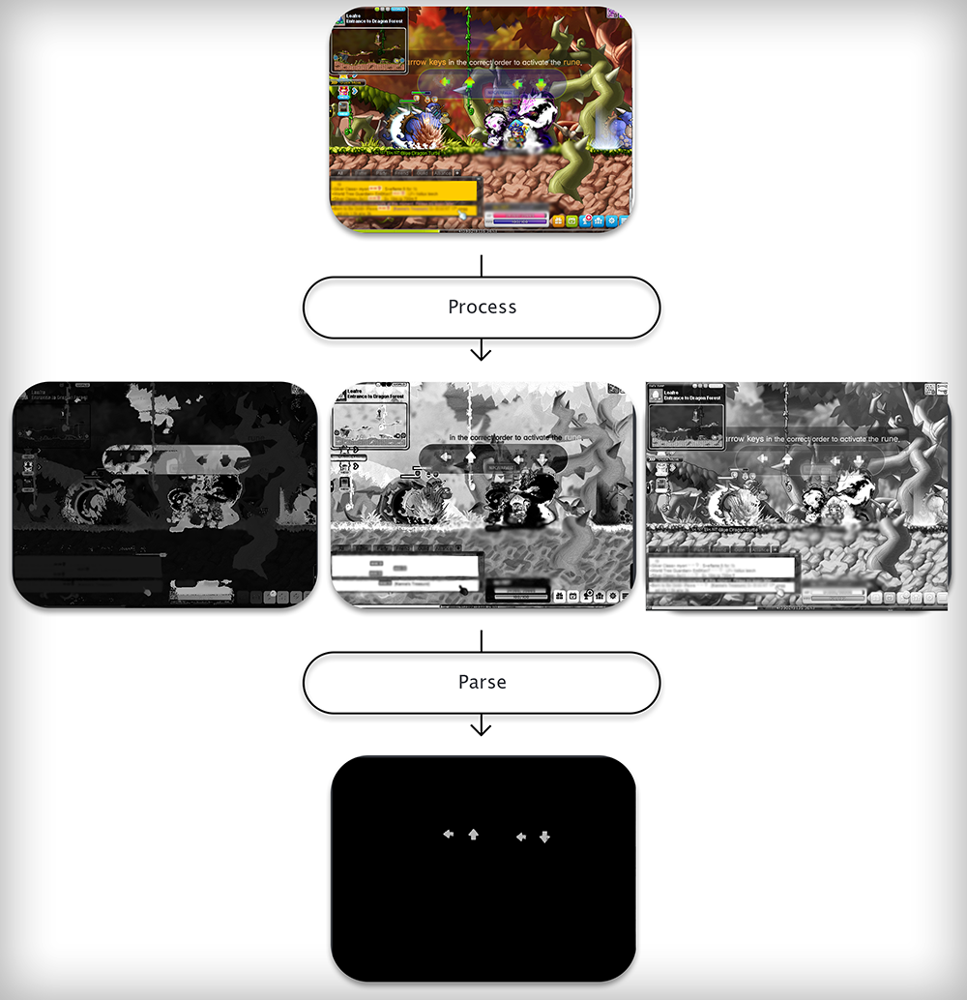

# maple-bot

This project aims to tackle the monotonous grind that players experience in MapleStory. 

This bot uses computer vision to find game features, being reliant on taking screenshots of the application window as a bitmap and parsing for pre-determined BGRA values. An implementation that accesses the game's memory could be faster but requires more maintenance and the knowledge to bypass game security. As this bot is external, it should undetected and functional throughout newer versions of the game unless changes are made affecting mini-map colors. 

To interact with the game, this bot uses a port of Interception (https://github.com/cobrce/interception_py) to simulate key presses. While using the libraries built with  Win32Api to send keystrokes, there is a bug that eventually causes MapleStory to memory leak and crash. This does not appear to be the case with Interception, making it ideal for prolonged usage. Interception also utilizes SC instead of VK. 

## Runes
Runes are a part of MapleStory's in-game anti-botting system. They come in the form of captchas that require the player to distinguish the directional orientation of 4
arrows. They appear every 15 minutes and when left unsolved, drastically reduce the amount of rewards earned by the player when killing monsters, hindering the effectiveness of many botting programs.

The approach taken to tackle this problem is heavily reliant on similar image-processing techniques mentioned above. As a result, this program is limited in its effectiveness and any changes to the current system can disable the effectiveness of this program.

### Observations
* The arrows have a certain amount of noise and dilation applied to them. This can make edge and contour detection difficult.
* The captchas that appear when activating runes were observed to appear within a certain portion of the application window. This can reduce the search space.
* The arrows were observed to be within a certain HSV range. This can help distinguish potential arrow locations.
* The arrows were observed to start from a red-ish color and end at a green-ish color. This can be used to find the directional orientation of the arrows.
* The arrows were observed to be 15 pixels apart and 30 pixels long. This can reduce the search space and filter any false positives.

### Approach
Screenshots are returned as a numpy.ndarray, containing BGRA values of each pixel. The color space of the image is converted from BGRA to HSV and is split into its respective channels. Search within the area that the captcha will appear for any red-ish colors, this will serve as the starting point for any potential arrows. From every starting point, search every direction for a green-ish color. If there is a valid gradient, a potential arrow has been found, and any nearby red-ish colors can be eliminated from the search space. This process is repeated until the image is fully searched. 

To create an image of the entire arrow, a DFS can be applied to expand the gradient outwards.

The images in `docs/rune_screenshots` test the effectiveness of this program. They were selected to showcase the diverse color backgrounds in MapleStory. When tested against those images, 13/15 images were correctly parsed.

## Examples 

This bot has been tested to be working with v224. You can find an example script in `main.py` for Hayato at SS4.

This video was recorded on an a friend's account, all actions taken by the character were perfomed by the bot.

https://user-images.githubusercontent.com/72103178/129638001-5dda39d8-910a-4450-882a-3791587bbb69.mp4

## Credits
* The high-speed screen capture program used in this project was created by Dustin. It is functional in a VM and is immensely faster than PyAutoGui and d3dshot.
* The graphics and image-editing were done by Steven.

## Disclaimer

This bot was made and intended for educational purposes only - use at your own discretion. Botting is against Nexon's EULA and will lead to suspensions against your account.
